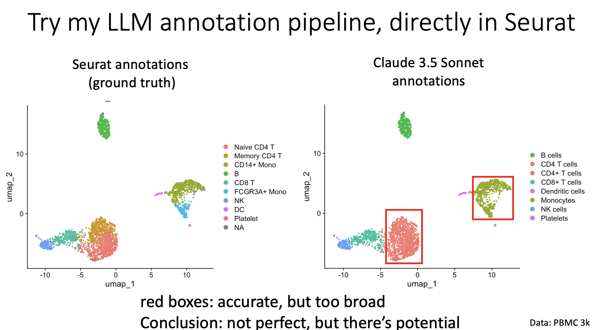

# LLM-based cell annotation

This repository gives you the ability to run LLM-based cell annotation directly within a Seurat pipeline. More broadly, it shows you how to call a LLM within R, using R objects as input, and storing the output as R objects. This allows you to do more complex things with LLMs, like annotating cell directly within a bioinformatics pipeline.

There has been some work by others to this end, but the purpose of this project is mainly to de-mystify the process, and thereby empower users to start incorporating LLMs directly into their work today.

## Instructions

Simply go into rmd, and pull out annotate_pbmc_3k_public.Rmd. This has all the code you need. It should run on its own, from anywhere. 

As a preliminary step, you need to sign up to [OpenRouter](https://openrouter.ai/), and get an API key. You only need to add to put in a couple dollars to "credits." You'll be operating on pennies or fractions of a penny for a given request. Then, you go to the line in the R Markdown that says user_api_key <- "your_api_key_here" and replace that with your API key, as a string.

## Notes for use

I will note that even if you control for random seeds, the LLM is going to name things differently each time, so when you run it, the cluster names from the LLM might not line up perfectly. For example, in the run the I display, the LLM did not distinguish between two types of monocytes, and two clusters were annotated as such. Running it again, and/or running it with a different model, you might get different results.

Note that these are not local instances of LLMs. This is an API call. Thus, if you are going to test it on your data, test it on data that have been published and/or de-anonymyzed. Assume that anything that gets put into the LLM is public.

This said, even if the best use case is to annotate private data, you should take this code and get a feel for how it works. When the time comes that it is cheap enough and/or easy enough to run a local instance of a sufficiently good LLM, then you will be happy that you are already familiar with how to integrate these insto your loca bioinformatics pipeline.

## Take-home message

Run this code initially on the PBMC 3k dataset (built in). Try different models. Try different prompts. Then run it on your own data. Ideally tougher datasets. See how it does. See where it breaks. And let me know what you find.

Below is an image of how it did on the PBMC 3k dataset in my hands.

